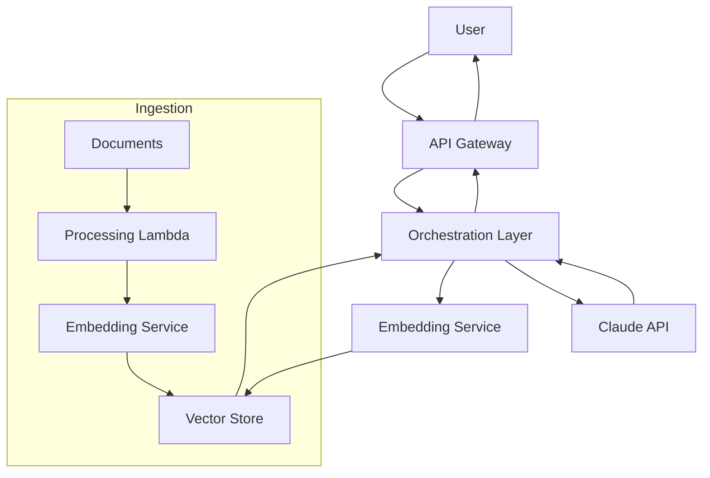

# PRD 03: Knowledge Base Specifications

## Document Info
- **Component**: Knowledge Layer
- **Format**: Static JSON Files
- **Location**: mcp-server/src/knowledge/
- **Status**: In Development

---

## Overview

The knowledge base provides the domain expertise that powers the MCP server's recommendations. It contains structured content about architecture patterns, compliance frameworks, and industry-specific templates.

---

## File Structure

```
mcp-server/src/knowledge/
├── architectures.json    # Architecture patterns and selection criteria
├── compliance.json       # Regulatory frameworks and requirements
└── industries.json       # Industry verticals and use case templates
```

---

## architectures.json

### Purpose
Define reusable architecture patterns for AI/LLM deployments, including component breakdowns, cloud service mappings, and visual diagrams.

### Schema

```typescript
interface ArchitecturesFile {
  patterns: Record<string, ArchitecturePattern>;
  patternSelection: {
    guidance: string;
    criteria: Record<string, { choose_when: string[] }>;
  };
}

interface ArchitecturePattern {
  name: string;                    // Human-readable name
  description: string;             // Brief description
  useCases: string[];              // When to use this pattern
  components: Record<string, {
    description: string;
    services: {
      aws: string[];
      gcp: string[];
      anthropic?: string[];
    };
  }>;
  dataFlow: string[];              // Numbered steps
  mermaidDiagram: string;          // Mermaid syntax
  securityConsiderations: string[];
  scalingConsiderations?: string[];
  humanInTheLoop?: {
    required: boolean;
    implementation: string[];
  };
}
```

### Required Patterns

#### 1. rag_document_qa
**Name**: RAG-Based Document Q&A

**Use Cases**:
- Policy and procedure lookups
- Benefits documentation search
- Clinical guideline reference
- Regulatory compliance queries

**Components**:
| Component | AWS Services | GCP Services |
|-----------|--------------|--------------|
| Ingestion | S3, Lambda, Bedrock Embeddings | Cloud Storage, Cloud Functions, Vertex AI |
| Vector Store | OpenSearch Serverless, Kendra | Vertex AI Vector Search, AlloyDB |
| Orchestration | Lambda, Step Functions | Cloud Functions, Cloud Run |
| LLM | Claude via Bedrock or API | Claude via Vertex AI or API |

**Data Flow**:
1. User submits query via API/UI
2. Query embedded using same model as documents
3. Vector similarity search retrieves relevant chunks
4. Retrieved context + query sent to Claude
5. Claude generates response with citations
6. Response returned to user with source references

**Mermaid Diagram**:


#### 2. conversational_agent
**Name**: Conversational Agent with Tool Use

**Use Cases**:
- Patient intake and triage
- Benefits enrollment assistance
- Appointment scheduling
- Claims status inquiries

**Components**:
| Component | AWS Services | GCP Services |
|-----------|--------------|--------------|
| Conversation Management | DynamoDB, ElastiCache | Firestore, Memorystore |
| Tool Registry | Lambda, API Gateway | Cloud Functions, Cloud Run |
| Orchestration | ECS/Fargate, App Runner | Cloud Run, GKE |
| LLM | Claude with tool_use | Claude with tool_use |

**Data Flow**:
1. User sends message
2. Retrieve conversation history from session store
3. Build context with history + available tools
4. Claude determines if tool use needed
5. If tool needed: execute tool, return result to Claude
6. Claude generates response
7. Store updated conversation state
8. Return response to user

#### 3. batch_processing
**Name**: Batch Processing Pipeline

**Use Cases**:
- Claims processing assistance
- Medical record summarization
- Prior authorization review
- Quality measure extraction

**Components**:
| Component | AWS Services | GCP Services |
|-----------|--------------|--------------|
| Job Queue | SQS, Step Functions, Batch | Cloud Tasks, Pub/Sub |
| Processing | Lambda, ECS, Batch | Cloud Functions, Cloud Run Jobs |
| Storage | S3, RDS, DynamoDB | Cloud Storage, Cloud SQL |
| Monitoring | CloudWatch, X-Ray | Cloud Monitoring, Trace |

#### 4. human_in_the_loop
**Name**: Human-in-the-Loop Review System

**Use Cases**:
- Clinical decision support
- Prior authorization decisions
- Appeal review assistance
- Quality assurance sampling

**Components**:
| Component | AWS Services | GCP Services |
|-----------|--------------|--------------|
| AI Processing | Lambda, ECS, Bedrock | Cloud Functions, Vertex AI |
| Review Queue | Step Functions, SQS | Cloud Workflows, Tasks |
| Review UI | Amplify, CloudFront | Firebase Hosting, Cloud Run |
| Decision Store | DynamoDB, RDS | Firestore, Cloud SQL |

**Human-in-the-Loop Requirements**:
- Confidence thresholds for escalation
- Explicit handoff to human agents
- Supervisor review for sensitive actions
- Clear AI disclosure to users

---

## compliance.json

### Purpose
Define regulatory frameworks with specific requirements, architecture implications, and implementation guidance.

### Schema

```typescript
interface ComplianceFile {
  frameworks: Record<string, ComplianceFramework>;
  complianceMatrix: Record<string, {
    description: string;
    requiredFrameworks: string[];
    recommendedFrameworks: string[];
    keyConsiderations: string[];
  }>;
}

interface ComplianceFramework {
  name: string;
  fullName: string;
  applicableWhen: string[];
  keyRequirements: Record<string, {
    title: string;
    items: string[];
  }>;
  architectureImplications: Record<string, {
    requirement: string;
    implementation: string[];
  }>;
  baaRequirements?: {
    description: string;
    mustInclude: string[];
    anthropicNote: string;
  };
}
```

### Required Frameworks

#### HIPAA (Primary - Detailed)

**Applicable When**:
- Processing Protected Health Information (PHI)
- Healthcare provider operations
- Health plan administration
- Healthcare clearinghouse functions
- Business associate relationships

**Key Requirements**:

| Category | Requirements |
|----------|--------------|
| Privacy Rule | Minimum necessary standard, patient authorization, Notice of Privacy Practices, patient rights, de-identification standards |
| Security Rule | Administrative safeguards, physical safeguards, technical safeguards |
| Breach Notification | 60-day notification, HHS notification for 500+, 6-year documentation |

**Architecture Implications**:

| Area | Requirement | Implementation |
|------|-------------|----------------|
| Data at Rest | Encryption required | AES-256, AWS KMS / GCP Cloud KMS |
| Data in Transit | Encryption required | TLS 1.2+, no PHI in URLs |
| Access Control | Unique user ID, RBAC | MFA, session timeout, emergency access |
| Audit Logging | Record system activity | Log all PHI access, 6-year retention |
| LLM Specific | Special AI considerations | BAA with provider, no training on PHI, HITL for clinical |

**BAA Requirements**:
- Permitted uses and disclosures
- Safeguards BA must implement
- Subcontractor requirements
- Breach notification obligations
- Termination provisions

**Anthropic Note**: "Anthropic offers BAAs for Claude API enterprise customers. Contact sales for healthcare deployments."

#### SOC 2 (Secondary)

**Trust Service Criteria**:
- Security (Required)
- Availability
- Processing Integrity
- Confidentiality
- Privacy

**Key Controls**:
- Logical and physical access controls
- System operations monitoring
- Change management procedures
- Risk mitigation strategies

#### FedRAMP (Reference)

**Impact Levels**:
| Level | Description | Controls |
|-------|-------------|----------|
| Low | Limited adverse effect | 125+ |
| Moderate | Serious adverse effect | 325+ |
| High | Severe/catastrophic effect | 421+ |

---

## industries.json

### Purpose
Define industry verticals with specific use cases, regulatory context, integration patterns, and stakeholder mappings.

### Schema

```typescript
interface IndustriesFile {
  industries: Record<string, Industry>;
  crossIndustryConsiderations: {
    dataResidency: { description: string; considerations: string[] };
    modelGovernance: { description: string; considerations: string[] };
    vendorManagement: { description: string; considerations: string[] };
  };
}

interface Industry {
  name: string;
  description: string;
  regulatoryContext: {
    primary: string[];
    secondary: string[];
    emerging: string[];
  };
  commonUseCases: Record<string, {
    name: string;
    examples: IndustryUseCase[];
  }>;
  integrationPatterns?: Record<string, {
    name: string;
    standards: string[];
    vendors?: string[];
    considerations: string[];
  }>;
  stakeholders: Record<string, string[]>;
}

interface IndustryUseCase {
  name: string;
  description: string;
  recommendedPattern: string;
  complianceNotes: string[];
  technicalConsiderations?: string[];
  estimatedComplexity: "low" | "medium" | "high";
  typicalTimeline: string;
}
```

### Healthcare Vertical (Primary - Detailed)

#### Regulatory Context
- **Primary**: HIPAA
- **Secondary**: SOC2, HITRUST
- **Emerging**: State privacy laws, FDA AI/ML guidance

#### Use Cases

**Patient-Facing Applications**:

| Use Case | Pattern | Complexity | Timeline |
|----------|---------|------------|----------|
| Patient Intake Assistant | conversational_agent | Medium | 12-16 weeks |
| Benefits Navigator | rag_document_qa | Medium | 10-14 weeks |
| Symptom Checker / Triage | human_in_the_loop | High | 16-24 weeks |

**Clinical Applications**:

| Use Case | Pattern | Complexity | Timeline |
|----------|---------|------------|----------|
| Clinical Documentation Assistant | human_in_the_loop | High | 20-28 weeks |
| Prior Authorization Assistant | human_in_the_loop | High | 16-20 weeks |

**Administrative Applications**:

| Use Case | Pattern | Complexity | Timeline |
|----------|---------|------------|----------|
| Claims Processing Assistant | batch_processing | High | 20-28 weeks |
| Medical Records Summarization | batch_processing | Medium | 12-16 weeks |

#### Integration Patterns

**EHR Integration**:
- Standards: FHIR R4, SMART on FHIR, CDS Hooks
- Vendors: Epic, Cerner, Meditech, Allscripts
- Considerations: Vendor-specific APIs, app marketplace, clinical workflow, SSO

**Payer Integration**:
- Standards: X12 EDI, FHIR Da Vinci, Portal APIs
- Considerations: Real-time vs batch, eligibility, claims, prior auth

#### Stakeholders

| Category | Roles |
|----------|-------|
| Clinical | CMO, CMIO, Clinical Informatics, Nursing Leadership |
| Technical | CIO, CISO, Enterprise Architecture, Integration Team |
| Business | COO, Revenue Cycle, Patient Experience, Compliance |
| Governance | Privacy Officer, Compliance Officer, Legal, Risk Management |

### Financial Services Vertical (Secondary - Reference)

#### Regulatory Context
- **Primary**: SOC2, SOX
- **Secondary**: GLBA, PCI-DSS, CCPA/CPRA
- **Emerging**: AI/ML model governance, explainability

#### Use Cases (Simplified)
- Customer Service Agent
- Document Processing
- Compliance Review

---

## Content Quality Guidelines

### Writing Style
- Use clear, professional language
- Be specific and actionable
- Include concrete examples
- Avoid jargon without explanation

### Accuracy Requirements
- Compliance information must be accurate (but note this is not legal advice)
- Cloud service names must be current
- Timelines should be realistic
- Complexity estimates should be defensible

### Maintenance
- Review quarterly for accuracy
- Update when cloud services change
- Add new patterns as they emerge
- Expand industry coverage based on demand

---

## Validation

### JSON Schema Validation
Each file should validate against its TypeScript interface. Use a tool like `ajv` or `zod` to validate at runtime.

### Content Completeness Checks

**architectures.json**:
- [ ] All 4 patterns defined
- [ ] Each pattern has components, dataFlow, mermaidDiagram
- [ ] AWS and GCP services listed for each component
- [ ] Security considerations included

**compliance.json**:
- [ ] HIPAA framework fully detailed
- [ ] SOC2 framework included
- [ ] Architecture implications for each requirement
- [ ] BAA information accurate

**industries.json**:
- [ ] Healthcare vertical fully detailed
- [ ] At least 6 use cases defined
- [ ] Integration patterns documented
- [ ] Stakeholder mappings included

---

## Loading Strategy

### Lazy Loading

```typescript
let complianceData: Record<string, unknown> | null = null;

function loadComplianceData(): Record<string, unknown> {
  if (!complianceData) {
    const content = readFileSync(join(knowledgePath, "compliance.json"), "utf-8");
    complianceData = JSON.parse(content);
  }
  return complianceData;
}
```

### Caching
- Load each file once on first access
- Cache in module-level variables
- No expiration (static content)

### Error Handling
- Catch JSON parse errors
- Provide helpful error messages
- Fail fast on missing files

---

## Future Content Expansion

### Phase 2
- Financial Services use cases (detailed)
- Education vertical
- Public Sector / FedRAMP details

### Phase 3
- Life Sciences / FDA considerations
- Retail / E-commerce
- Manufacturing / Industrial

### Content Sources
- AWS Well-Architected Framework
- GCP Architecture Center
- HIPAA Security Rule guidance
- SOC 2 Trust Service Criteria
- Industry analyst reports
- Anthropic documentation
